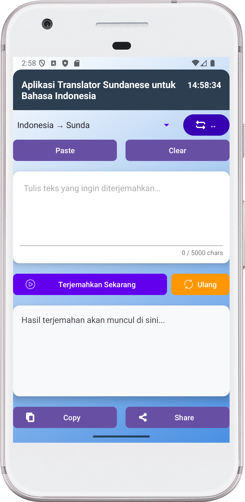
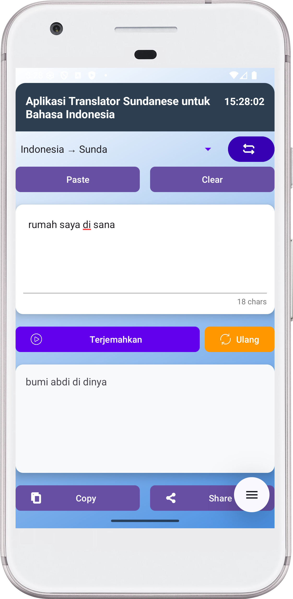

# 👥 Contributors

## Hilman Maulana
**UIN Sunan Gunung Djati Bandung (UIN Bandung)**  
_Inisiator & Kontributor Utama — Project Lead_

> Penggagas arsitektur aplikasi **Translator Sundanese**, fokus pada kualitas UX, stabilitas jaringan (Retrofit + Coroutines), dan tata letak Material yang rapih serta mudah di-maintain.

**Peran & Kontribusi Utama**
- 🧭 **Project direction**: Menentukan scope, roadmap, dan standar coding (naming, struktur paket, dan konvensi commit).
- 🎨 **UI/UX**: Mendesain layout berbasis ConstraintLayout + CardView, aksesibilitas, serta komponen Material (copy/share/retry, counter, jam real-time).
- 🔌 **Integrasi API**: Menyusun `TranslateApi`, `provideApi()`, dan penanganan error/timeout + indikator loading.
- ⚙️ **Build & Tooling**: Menyiapkan Gradle config (Retrofit 2.11, Gson, OkHttp), vector drawables, serta compatibility minSdk/targetSdk.
- 🧪 **Quality**: Pengujian manual (happy/edge cases), resource linking fix, dan perapihan XML/tema (AppCompat/Material3).

**Highlight**
- Mengubah ribuan karakter kode menjadi pengalaman terjemahan **Indonesia ↔ Sunda** yang cepat, ringan, dan enak dipakai.
- Mendorong praktik **lifecycle-aware** (repeatOnLifecycle) untuk fitur jam real-time yang efisien dan bebas memory leak.

**Kontak & Jejak**
- GitHub: [@hilmanmaulana1237](https://github.com/hilmanmaulana1237)
- Kampus: UIN Sunan Gunung Djati Bandung — Teknik Informatika
- Minat: Android/Kotlin, UI/UX, arsitektur client–API, dan open-source kolaboratif

---

> Ingin ikut berkontribusi? Buka **Issues** atau **Pull Request**, dan ikuti _contribution guidelines_ di repo. Kontributor baru selalu disambut! 🚀


---

# 📘 Sunda Translator — Android (Kotlin)

Aplikasi Android sederhana untuk menerjemahkan **Indonesia ↔ Sunda** yang berfokus pada kemudahan pakai, ukuran aplikasi kecil, dan integrasi jaringan yang stabil. Aplikasi ini menggunakan backend proxy publik yang kamu host di Vercel:
`https://api-translate-lemon.vercel.app/translate?engine=google&text=...&to=...`  
Proxy tersebut meneruskan permintaan ke mesin terjemahan dan mengembalikan hasil dalam format JSON; aplikasi hanya mengambil nilai final dari **`data.result`** sehingga parsing di sisi Android tetap ringan dan cepat. Dengan arsitektur ini kamu dapat mengganti atau memindahkan backend tanpa mengubah kode UI (cukup ubah `BASE_URL`), dan kamu dapat menambahkan fitur seperti caching atau rate limiting di sisi server kapan saja.

Secara default aplikasi menyediakan dua arah utama: **Indonesia → Sunda** (`to=su`) dan **Sunda → Indonesia** (`to=id`). Kamu bisa menambahkan bahasa lain selama backend mendukung kode ISO-nya (mis. `to=en` untuk Inggris). Dari sisi UX, aplikasi meminimalkan friksi: input teks multi-baris, tombol **Terjemahkan** dengan indikator **loading**, serta hasil yang bisa langsung **disalin** atau **dibagikan**. Untuk koneksi yang kurang stabil, aplikasi menampilkan pesan kesalahan yang ramah pengguna dan menyediakan tombol **Ulang** untuk mengirim permintaan terakhir tanpa perlu mengetik ulang.

Demi privasi, aplikasi tidak menyimpan teks pengguna secara permanen dan tidak memerlukan izin sensitif; seluruh komunikasi jaringan hanya membutuhkan **INTERNET permission** dan berjalan melalui HTTPS. Karena proxy berada di Vercel, latensi umumnya rendah, namun pada jaringan yang padat kamu dapat melihat sedikit penundaan—di sinilah indikator loading membantu memberi feedback yang jelas. Arsitektur kode memisahkan **UI** dari **lapisan jaringan (Retrofit)** dan **model respons**, sehingga mudah di-_scale_: ke depan kamu bisa menambahkan **ViewModel/Repository**, **cache offline (Room)**, atau bahkan **deteksi bahasa otomatis** sebelum menentukan nilai `to`. Singkatnya, Sunda Translator didesain sebagai pondasi yang bersih, dapat diperluas, dan siap dipakai untuk kebutuhan belajar maupun publikasi ringan di luar Play Store.

## 🖼️ Preview Aplikasi

## 📷 Main Home


## 📷 Running


## 🎞️ Video Preview
[Demo Aplikasi](https://youtube.com/shorts/TWIPhioR8fc?si=KTLkvXJfaRV3S9sr)

## 🗂️ Aplikasi .apk
[Link Aplikasi](https://drive.google.com/drive/folders/1PoclyqBvkYV9-UwAc2jspU4O9de_U8Mr?usp=sharing)


---

## ✨ Fitur

- Pilih arah terjemahan: **ID → SU** / **SU → ID**
- Tombol **Terjemahkan** dengan indikator **loading**
- **Swap** arah (↔), **Paste/Clear** input
- **Copy/Share** hasil, **Retry** request terakhir
- **Counter** jumlah karakter
- UI rapi: header gelap (rounded), background gradient
- Status bar gelap (opsi non edge-to-edge atau edge-to-edge + padding insets)

---

## 🗂️ Struktur Proyek

```
app/
├─ src/main/
│  ├─ AndroidManifest.xml
│  ├─ java/<paketmu>/
│  │  ├─ MainActivity.kt
│  │  ├─ Network.kt
│  │  ├─ TranslateApi.kt
│  │  └─ TranslateModels.kt
│  └─ res/
│     ├─ layout/activity_main.xml
│     ├─ drawable/gradient_background.xml
│     ├─ drawable/header_background.xml
│     ├─ drawable/ic_copy.xml            # opsional
│     ├─ drawable/ic_share.xml           # opsional
│     ├─ drawable/swap.xml               # opsional
│     ├─ drawable/play.xml               # opsional
│     ├─ drawable/reload.xml             # opsional
│     └─ values/{colors.xml, themes.xml, strings.xml}
```

---

## ⚙️ Setup Singkat

**1) Izin Internet (AndroidManifest.xml)**

```xml
<uses-permission android:name="android.permission.INTERNET" />
```

**2) Dependensi (Module: app)**

```gradle
implementation "com.squareup.retrofit2:retrofit:2.11.0"
implementation "com.squareup.retrofit2:converter-gson:2.11.0"
implementation "com.squareup.okhttp3:logging-interceptor:5.0.0-alpha.14"
implementation "org.jetbrains.kotlinx:kotlinx-coroutines-android:1.8.1"
```

**3) Base URL (Network.kt)**

```
https://api-translate-lemon.vercel.app/
```

**4) Kontrak API**

- `GET /translate?engine=google&text={teks}&to={kode}`
- Kode bahasa: `su` (Sunda), `id` (Indonesia)
- Contoh respons:

```json
{
  "status": true,
  "message": "success",
  "data": { "origin": "id", "result": "Halo Dunya", "targets": [] }
}
```

---

## ▶️ Cara Menjalankan

1. Buka di **Android Studio** → **Sync Gradle** hingga selesai.
2. **Run ▶** pada emulator/perangkat.
3. Pilih arah, ketik teks, tekan **Terjemahkan**.

**Uji backend (opsional)**

```bash
curl "https://api-translate-lemon.vercel.app/translate?engine=google&text=halo%20dunia&to=su"
```

---

## 🧯 Troubleshooting

- **`R` unresolved** → Periksa error di XML, lalu **Rebuild**.
- **Network error/timeout** → Cek koneksi & pastikan base URL benar.
- **Status bar ketutup**
  - Non edge-to-edge: `android:fitsSystemWindows="true"` + set `statusBarColor` gelap.
  - Edge-to-edge: `decorFitsSystemWindows(false)` + padding status bar pada header + ikon status bar putih.
- **`trim()` error** → Pastikan panggil `toString().trim()` dari `Editable/CharSequence` (contoh: `etInput.text.toString().trim()`).

---

## 🧭 Roadmap Singkat

- Migrasi ke **MVVM (ViewModel + Repository)**
- Material 3 theming & dynamic color
- Riwayat & cache offline (Room)
- GitHub Actions (CI) untuk build & lint

---

## 🙌 Kredit

- Backend proxy: **azharimm/api-translate** (deploy di Vercel)
- Aplikasi Android: proyek ini

---

## 📝 License (MIT)

Copyright (c) 2025

Permission is hereby granted, free of charge, to any person obtaining a copy
of this software and associated documentation files (the "Software"), to deal
in the Software without restriction, including without limitation the rights
to use, copy, modify, merge, publish, distribute, sublicense, and/or sell
copies of the Software, and to permit persons to whom the Software is
furnished to do so, subject to the following conditions:

The above copyright notice and this permission notice shall be included in all
copies or substantial portions of the Software.

THE SOFTWARE IS PROVIDED "AS IS", WITHOUT WARRANTY OF ANY KIND, EXPRESS OR
IMPLIED, INCLUDING BUT NOT LIMITED TO THE WARRANTIES OF MERCHANTABILITY,
FITNESS FOR A PARTICULAR PURPOSE AND NONINFRINGEMENT. IN NO EVENT SHALL THE
AUTHORS OR COPYRIGHT HOLDERS BE LIABLE FOR ANY CLAIM, DAMAGES OR OTHER
LIABILITY, WHETHER IN AN ACTION OF CONTRACT, TORT OR OTHERWISE, ARISING FROM,
OUT OF OR IN CONNECTION WITH THE SOFTWARE OR THE USE OR OTHER DEALINGS IN THE
SOFTWARE.
